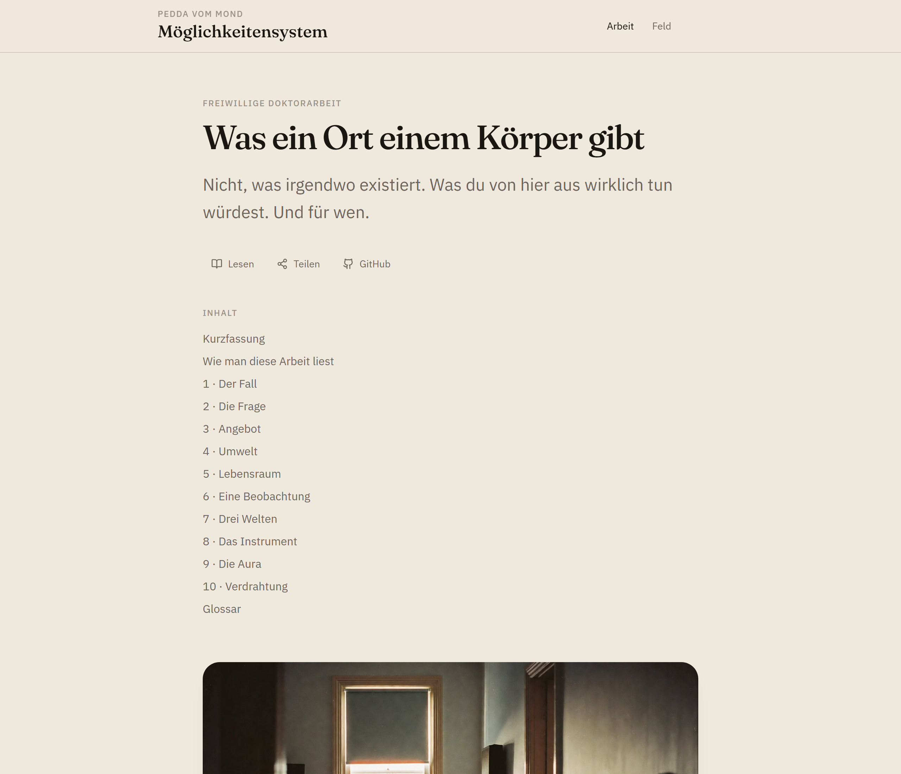
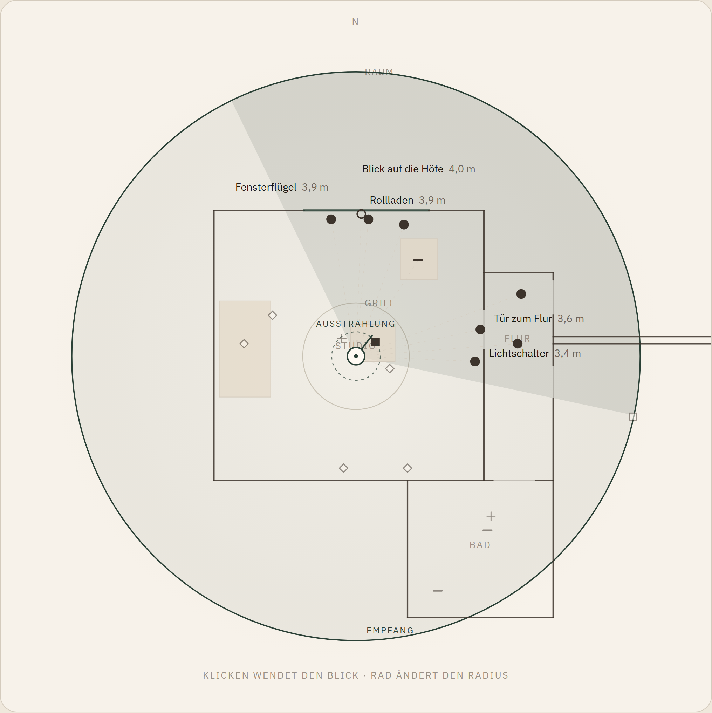
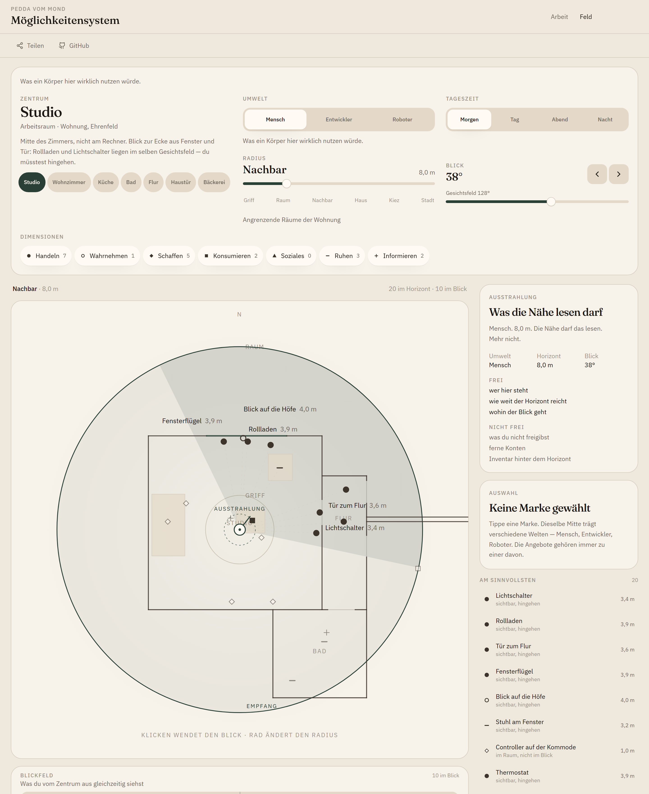
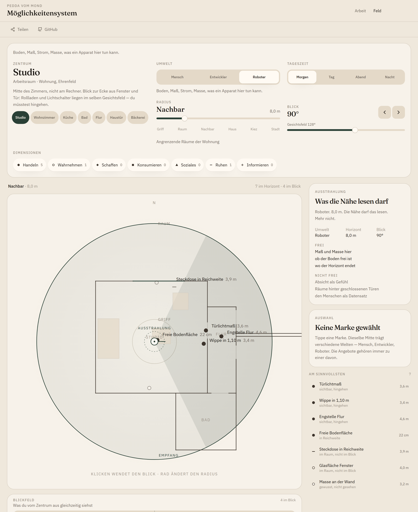
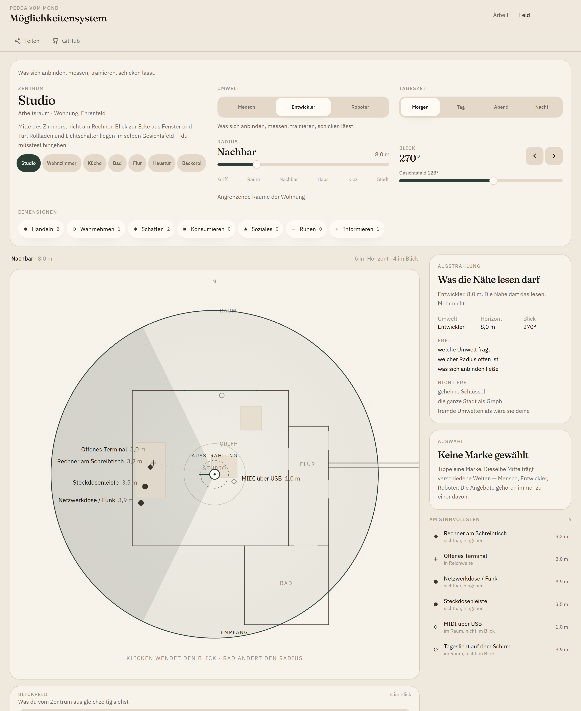
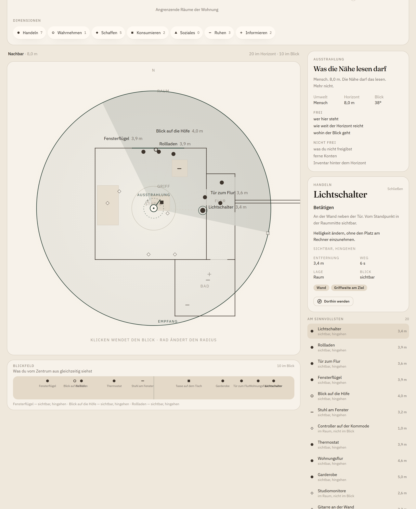
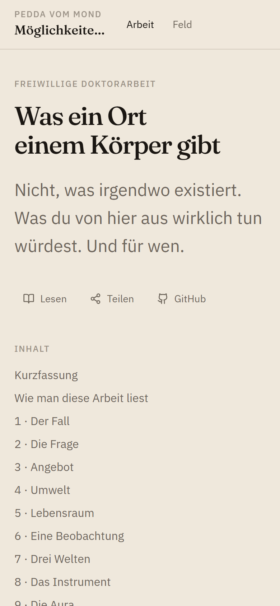
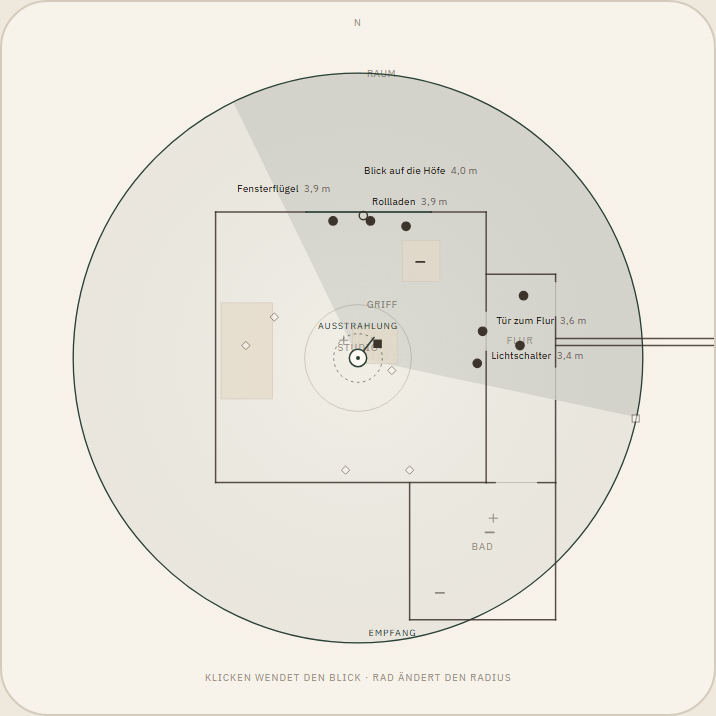

# Möglichkeitensystem

Freiwillige Doktorarbeit.
Was ein Ort einem Körper gibt — nicht, was irgendwo existiert.

Ein Mensch, jemand der Software baut, ein Roboter: drei Listen. Nicht eine.

[](https://peddavommond.de/moeglichkeitensystem)
[](src/lib/moeglichkeiten/kernel.test.ts)
[](LICENSE)

| | |
|---|---|
| Arbeit | [peddavommond.de/moeglichkeitensystem](https://peddavommond.de/moeglichkeitensystem) |
| Feld | […/feld](https://peddavommond.de/moeglichkeitensystem/feld) |
| Kern | Gibson · Uexküll · Lewin — dann die Aura, zwei Richtungen |

<p align="center">
  
</p>

Die Arbeit ist der Text. Das Feld ist die Prüfung. Kapitel 7 muss in unter einer Minute sichtbar sein. Kapitel 9 hält die Aura, bevor irgendetwas verdrahtet wird.

<p align="center">
  
</p>

## Drei Listen, nicht eine

Dieselbe Raummitte. Drei Schalter. Der Umweltwechsel ändert Blick, Marken und Bestände.

<p align="center">
  
  &nbsp;
  
</p>

<p align="center">
  
</p>

| Umwelt | Sieht zuerst | Sieht nicht als Angebot |
|---|---|---|
| Mensch | Schalter, Gurt, Tasse, Weg zur Bäckerei | Die Dose als Last, das Türlichtmaß |
| Entwickler | Rechner, Terminal, Feed, Anschluss | Stimmung, Bestand als Geschmack |
| Roboter | Boden, Schwelle, Dose, Engstelle | Klang, Hunger, Begrüßung |

Dose und Schalter sind nie dieselbe Marke.

## Die Aura. Zwei Richtungen.

Empfang: der Ort bietet. Ausstrahlung: der Körper gibt der Nähe etwas zu lesen.

<p align="center">
  
</p>

Neun Sätze in der Arbeit. Dieselbe Logik im Instrument. Kein Konto. Keine Cloud als Torwächter der Nähe.

## Inspector

Eine Marke erklärt sich am Ort. Nicht in einer Property-Tabelle.

<p align="center">
  
</p>

## Tablet

<p align="center">
  
  &nbsp;
  
</p>

Geschrieben für ein Tablet. Drucken lässt die Leiste weg. Skip-Links, Inhaltsverzeichnis, kanonische Domain.

## Modell

`viewFrom(locus, radius, facing, fov, time, dimensions, umwelt)` ist der Vertrag.

```text
src/lib/moeglichkeiten/     reiner Kernel, ohne React
  types.ts                  Angebot trägt eine Umwelt
  model.ts                  Filter, Distanz, Blick, Rang
  umwelten.ts               drei Listen, nie eine
  aura.ts                   Ausstrahlung: was die Nähe lesen darf
  kernel.test.ts            Umweltfilter und Aura
```

Nah kartesisch. Weit log-polar. Horizon-Collapse, sobald der Radius zu viele Marken trägt.

## Repository

```text
src/components/arbeit/      Kapitel 0–10, Glossar, Aura
src/components/field/       Instrument plus Aura-Tafel
src/lib/moeglichkeiten/     Kernel
docs/architecture.md        Ist-Stand der Schichten
docs/media/                 README-Figuren
docs/process/               STATE, Roadmap, Journal
```

Auth und PGlite sind Scaffold der Preview-Plattform. Die Arbeit erzwingt sie nicht.

## Lokal

```bash
./startup.sh
```

Oder `npm install` und `npm run dev`.

```bash
npm test            # Umweltfilter und Aura
npm run typecheck
npm run build
npm run shots       # schreibt docs/media/ (Dev-Server muss laufen)
```

Production hängt an `main`. Öffentliche URL bleibt [peddavommond.de/moeglichkeitensystem](https://peddavommond.de/moeglichkeitensystem).

## Was bewusst nicht gebaut ist

| Draußen | Warum |
|---|---|
| Social Feed, Punkte, Community | Verdünnt den Kern |
| Eine Geräte-App mit Philosophie-Firnis | Das wäre Inventar |
| Navigation A→B als Selbstzweck | Asphalt, kein Lebensraum |
| Echte Home-Assistant-Kopplung ohne Grenze | Erst die Sätze, dann das Kabel |
| Norman als eigenes Kapitel | Nur die eine Verwechslung mit Gibson |
| Erfundene Seitenzahlen, erfundene Laden-Namen | Die Arbeit bleibt zitierbar |

Stand und nächster Hebel: [docs/process/STATE.md](docs/process/STATE.md).
Phasen: [docs/process/ROADMAP.md](docs/process/ROADMAP.md).
Mitmachen: [CONTRIBUTING.md](CONTRIBUTING.md).

## Lizenz

Code: [MIT](LICENSE).
Die Arbeit (Kapitelprosa) bleibt © Pedda vom Mond.
